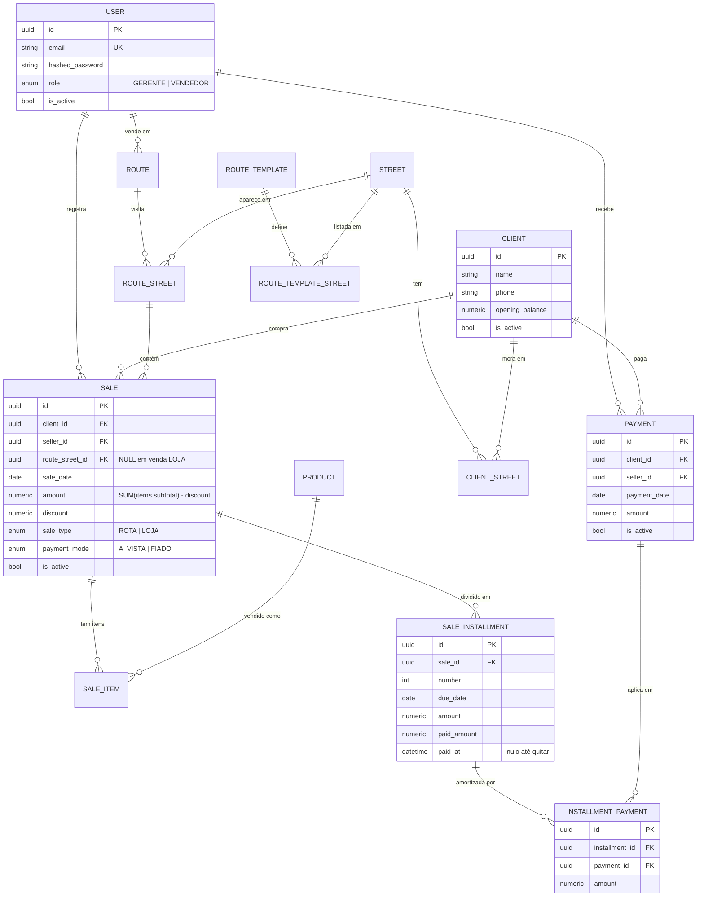
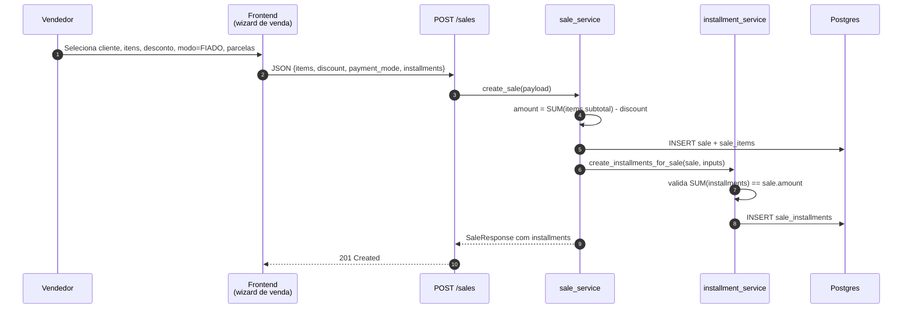
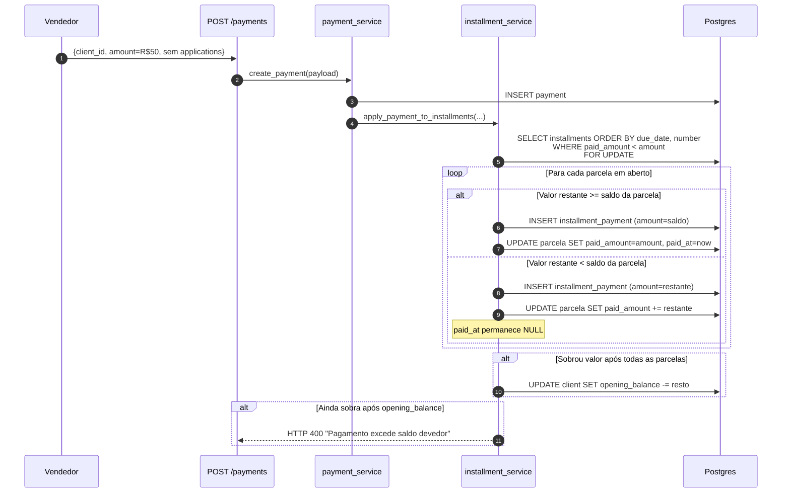

# Arquitetura — RotaVenda

Este documento descreve a arquitetura de alto nível do sistema, a modelagem de
dados e os fluxos mais importantes do ponto de vista de negócio.

Para decisões de design documentadas em detalhe, consulte [`docs/adr/`](docs/adr/).

---

## Visão de componentes

```mermaid
flowchart TB
    subgraph Client["Cliente"]
        Browser[Browser / Mobile PWA]
    end

    subgraph Frontend["Next.js 15 (App Router)"]
        Pages[Páginas segmentadas<br/>app/(app) · app/(auth)]
        Hooks[Hooks de dados<br/>TanStack Query]
        Axios[lib/api.ts<br/>Axios + interceptors]
    end

    subgraph Backend["FastAPI"]
        Routers[Routers /api/v1<br/>autenticação + validação]
        Services[Services<br/>regras de negócio]
        Models[Models SQLAlchemy]
        Alembic[Alembic<br/>migrations reversíveis]
    end

    DB[(PostgreSQL 16)]

    Browser -->|HTTPS| Pages
    Pages --> Hooks
    Hooks --> Axios
    Axios -->|JWT Bearer<br/>+ refresh cookie| Routers
    Routers --> Services
    Services --> Models
    Models --> DB
    Alembic --> DB
```

**Princípio:** os routers são finos — apenas extraem o request, chamam um
service e retornam o `response_model`. Toda decisão de negócio
(validação de invariantes, cálculo de totais, matching FIFO) mora em
[`app/services/`](backend/app/services/). Ver [ADR 0003](docs/adr/0003-router-fino-service-gordo.md).

---

## Diagrama de entidades



### Notas sobre a modelagem

- **UUID como PK** em todas as tabelas — evita conflito em importação e
  permite gerar IDs no cliente sem *round trip*.
- **`CLIENT_STREET`** é uma tabela associativa com `house_number`,
  `reference` e `display_order` — suporta clientes com mais de um endereço.
- **`ROUTE_STREET`** representa a *instância* de uma rua numa rota do dia, com
  status próprio (`PENDING` → `IN_PROGRESS` → `COMPLETED`).
- **`ROUTE_TEMPLATE`** é *blueprint* reutilizável — o vendedor duplica no dia
  para criar uma rota. Ver [ADR 0005](docs/adr/0005-templates-imutaveis-de-rota.md).
- **Cliente não tem coluna `saldo`.** O saldo é derivado em tempo real:
  `SUM(sales FIADO ativas) − SUM(payments ativos) + opening_balance`.
  Ver [ADR 0001](docs/adr/0001-saldo-calculado.md).

---

## Fluxo 1 — Venda fiado com parcelas



**Invariantes garantidas pelo backend:**

- O campo `amount` recebido do cliente é ignorado em vendas com itens — o
  total é sempre recalculado a partir de `SUM(sale_items.subtotal) - discount`.
- A soma dos `installments.amount` precisa bater com `sale.amount` (tolerância
  de 1 centavo para erros de arredondamento decimal).
- `route_street_id` só é aceito para vendas de tipo `ROTA`.

---

## Fluxo 2 — Pagamento com matching FIFO

Quando o vendedor registra um pagamento **sem** indicar em quais parcelas
aplicar, o backend distribui o valor automaticamente na ordem
`due_date ASC, number ASC` — quita a mais antiga primeiro, consome o saldo,
e vai para a próxima. Se ainda sobrar valor depois que todas as parcelas
estão quitadas, amortiza o `opening_balance` do cliente. Se ainda sobrar,
retorna HTTP 400 (pagamento excede dívida).



**Por que `FOR UPDATE`:** dois pagamentos simultâneos do mesmo cliente
poderiam ler o mesmo `paid_amount` e ambos considerar a parcela em aberto,
resultando em dupla amortização. O lock de linha na consulta evita isso.

Cobertura de testes deste fluxo em
[`test_payment_service.py::TestFifoMatching`](backend/tests/test_payment_service.py).

---

## Fluxo 3 — Edição de venda com imutabilidade condicional

Editar uma venda após quitação parcial é perigoso: o valor histórico das
parcelas já foi registrado em `installment_payments` e o saldo do cliente
depende dele. A regra adotada:

```mermaid
flowchart TD
    Start[PUT /sales/:id] --> Check{Alguma parcela<br/>com paid_amount > 0?}
    Check -->|Não| Allow[Permite alterar<br/>items, discount, installments, payment_mode]
    Check -->|Sim| Block{Campos solicitados?}
    Block -->|items ou discount| Reject[HTTP 400<br/>Bloqueio de integridade]
    Block -->|description apenas| Allow
    Allow --> Recalc[Se items/discount mudaram:<br/>amount = SUM(subtotal) - discount]
    Recalc --> Save[UPDATE sale]
```

Essa regra é testada em
[`test_sale_service.py::TestUpdateSale`](backend/tests/test_sale_service.py).

---

## Autenticação e autorização

- **Access token** — JWT curto (30 min por padrão), guardado em `localStorage`.
  Enviado em `Authorization: Bearer <token>`.
- **Refresh token** — JWT de 7 dias, guardado em cookie `httpOnly` para que
  JavaScript do browser não consiga ler (defesa contra XSS). Ver
  [ADR 0002](docs/adr/0002-refresh-token-cookie.md).
- **`get_current_user`** em [`api/deps.py`](backend/app/api/deps.py) é a única
  porta de autenticação; todos os routers protegidos dependem dela.
- **`require_gerente`** é a porta extra para endpoints restritos (criação de
  usuário, relatórios agregados, exclusão de pagamento).

---

## Estratégia de testes

- **Integração contra Postgres real** — usa o mesmo banco do `.env`.
- **Isolamento por savepoint** — cada teste abre uma transação externa e uma
  interna (via `join_transaction_mode="create_savepoint"`); `commit()` feito
  dentro do service libera o savepoint, e a transação externa é revertida no
  teardown. Zero poluição entre testes, zero teardown manual.
- **Fixtures** em `conftest.py` cobrem `gerente`, `vendedor` e headers com JWT.
- **CI** roda `black --check`, `isort --check-only`, `alembic upgrade head` e
  `pytest --cov`. Ver [`.github/workflows/ci.yml`](.github/workflows/ci.yml).

---

## Operação

### Migrations

Toda mudança de schema passa por Alembic, com `upgrade()` e `downgrade()`
implementados. A migration mais recente é aplicada automaticamente no startup
do container backend (`alembic upgrade head` no `command` do `docker-compose.yml`).

### Seed sintético

[`backend/app/db/seed_demo.py`](backend/app/db/seed_demo.py) popula o banco
com dados 100% fictícios (`Faker` pt_BR + semente fixa `42`), cobrindo ruas,
produtos, usuários, clientes, template de rota, rota ativa, vendas mistas e
pagamentos FIFO. Idempotente — seguro rodar múltiplas vezes.

### Soft-delete

Entidades principais (`sales`, `payments`, `clients`, `users`, `products`)
nunca são apagadas fisicamente — `is_active` é flipado para `False`. Ver
[ADR 0004](docs/adr/0004-soft-delete-via-is-active.md).
