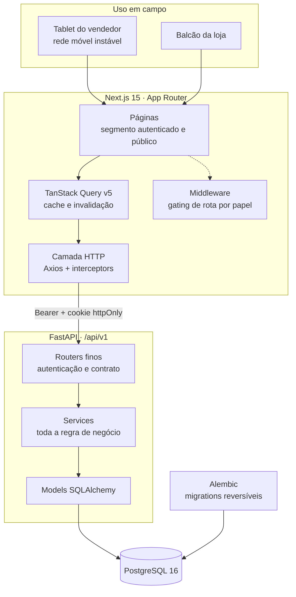
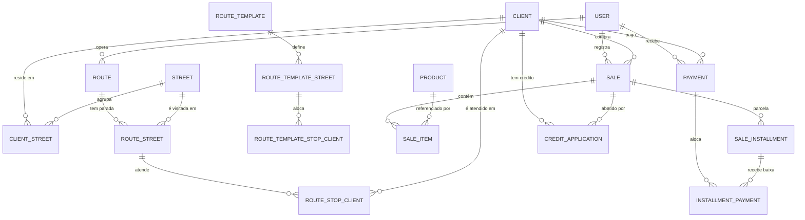
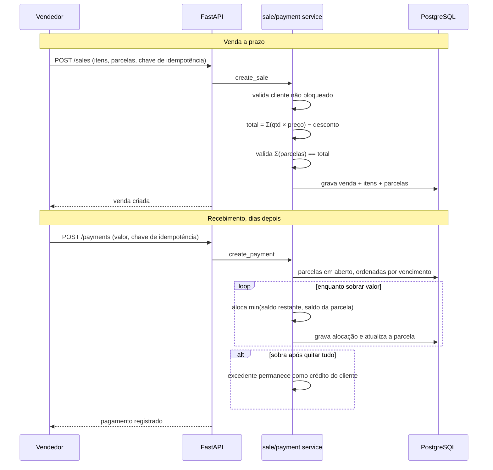
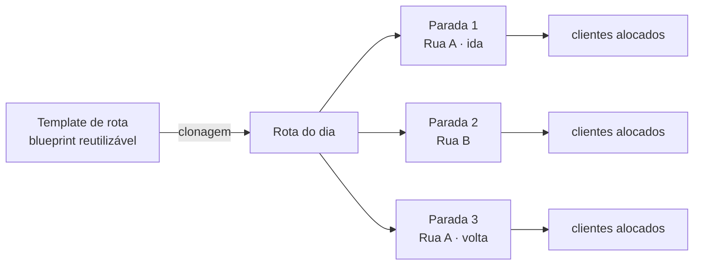
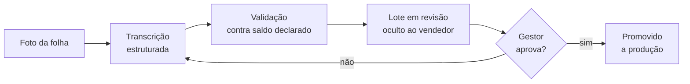

# Arquitetura — RotaVenda

Documento técnico do sistema em produção na D'Lucri: visão de componentes,
modelagem de dados, os fluxos que concentram a complexidade do domínio e os
trade-offs assumidos.

As decisões formais estão registradas em [`docs/adr/`](docs/adr/).

---

## 1 · Visão de componentes



**Princípio estrutural.** Os routers são finos: extraem o request, chamam um
service e devolvem o modelo de resposta. Toda decisão de negócio — validação de
invariantes, cálculo de totais, alocação FIFO, regras de bloqueio — mora na
camada de serviço. Nenhum router contém condicional de domínio.

Isso não é preferência estética. O sistema tem três superfícies que precisam
aplicar as mesmas regras (API HTTP, scripts de migração do acervo e seeds
operacionais); regra em router só funcionaria na primeira.

---

## 2 · Modelo de dados



**Notas de modelagem**

- **Chaves.** UUID em todas as entidades. Identificador sequencial vazaria
  volume de negócio e complicaria a consolidação de lotes da migração.
- **`sale_items` é snapshot.** Preço e descrição são copiados no momento da
  venda. Alterar o catálogo hoje não pode reescrever o histórico de crédito de
  ninguém.
- **`installment_payments` é a tabela central do domínio.** Ela materializa
  *quanto de cada pagamento foi para cada parcela* — é o que torna a baixa FIFO
  auditável e o estorno reversível.
- **Exclusão lógica** via sinalizador de atividade em vendas, pagamentos e
  clientes. Registro financeiro não é apagado fisicamente.
- **Bloqueio ≠ exclusão.** Cliente bloqueado continua visível e operável à
  vista; apenas o crédito novo é negado. São dois conceitos distintos, com
  colunas distintas — confundi-los foi um erro corrigido cedo.

---

## 3 · O fluxo central: venda a prazo e baixa FIFO

Este é o núcleo do sistema. Tudo o mais orbita em torno dele.



**Por que o total é recalculado no servidor.** O cliente HTTP envia itens e
quantidades, nunca o valor. Se enviasse, uma requisição adulterada — ou
simplesmente um bug de arredondamento no frontend — inscreveria uma dívida
incorreta no nome de uma pessoa real.

**Por que o excedente vira crédito e não erro.** Na operação real o cliente
frequentemente arredonda para cima. Rejeitar o pagamento obrigaria o vendedor a
recusar dinheiro na porta da casa. O excedente é retido como crédito e aplicado
explicitamente em compra futura, com registro próprio.

### Cálculo de saldo

```
saldo_líquido = débito − crédito

débito  = Σ (parcela.valor − parcela.valor_pago)   sobre vendas a prazo ativas
crédito = Σ pagamentos ativos − Σ alocações em parcelas
```

Saldo negativo significa crédito a favor do cliente. A fórmula tem **uma única
implementação canônica**, com variante em lote para listagens; os demais
serviços delegam a ela. Essa unificação foi uma dívida técnica identificada e
paga — a regra havia se duplicado em quatro pontos, e a divergência entre eles
era questão de tempo.

---

## 4 · Rota como sequência de paradas

A primeira modelagem tratava rota como *lista de ruas*. A operação real
desmentiu o modelo: o vendedor percorre a mesma via na ida e na volta,
atendendo clientes diferentes em cada passagem — e o modelo original tinha uma
restrição de unicidade que tornava isso impossível de representar.



**O que mudou.** A restrição de unicidade foi removida, cada parada ganhou
rótulo próprio e a alocação de clientes passou a pertencer à parada, não à rua.
O template carrega a divisão de clientes e é **clonado** — não referenciado — a
cada nova rota, de modo que reorganizar o template não reescreve o histórico de
rotas já executadas.

**Execução guiada.** A interface apresenta uma parada por vez, com avanço
automático ao concluir. O vendedor não escolhe em qual tela está: o sistema o
conduz. Decisão de produto direta — reduzir carga cognitiva de quem opera em pé,
na rua, com uma mão.

---

## 5 · Migração do acervo em papel

O maior risco do projeto não era técnico, era de confiança: se um único cliente
aparecesse com dívida errada, o sistema perderia credibilidade e a operação
voltaria ao caderno.



**Decisões que sustentaram a confiança**

- Lote nasce **oculto**. Só o gestor enxerga até liberar — o vendedor nunca vê
  dado não conferido.
- Divergência entre a soma das linhas e o saldo declarado no caderno **bloqueia**
  a promoção do lote.
- Rasura, nome apagado e valor ambíguo têm regra de resolução documentada e
  aplicada de forma uniforme; não são decisão de quem digita.
- O processo é **idempotente**: reexecutar um lote não duplica registro.

Resultado: 160 folhas, 680 registros e cerca de R$ 31 mil em crédito
reconciliado sem contestação em produção.

---

## 6 · Resiliência e segurança

| Preocupação | Tratamento |
| --- | --- |
| Rede móvel instável | Chave de idempotência em criação de venda e pagamento; a repetição retorna o recurso original |
| Roubo de token via XSS | Renovação em cookie `httpOnly`; acesso de vida curta; autorização sempre reverificada no servidor |
| Escalada de privilégio | Papel resolvido no servidor a cada requisição; o cookie de papel serve apenas para decidir renderização |
| Força bruta em login | Limite de taxa aplicado seletivamente no endpoint exposto |
| Corrupção de histórico | Exclusão lógica, estorno reversível e trilha de auditoria imutável |
| Erro de esquema em produção | Todas as migrations implementam o caminho de volta |
| Perda de dados | Rotina de backup e restauração documentada e testada |

---

## 7 · Estratégia de testes

Trinta e uma suítes de integração cobrem o que dá prejuízo se quebrar:
consistência de saldo, alocação e estorno, idempotência, autorização por papel,
normalização de telefone, tratamento de datas e geração de exportações.

**Isolamento por savepoint.** Cada teste executa dentro de uma transação
revertida ao final. Não há banco dedicado, seed prévio nem rotina de limpeza —
e não se paga o custo de recriar o esquema a cada execução.

**O que é deliberadamente coberto por teste, não por tipo.** Regras temporais —
"não editar venda com parcela paga", "não vender a prazo para cliente
bloqueado" — dependem de estado em tempo de execução. Nenhum sistema de tipos as
captura; testes capturam.

---

## 8 · Dívidas conhecidas

Registrar o que ainda não está resolvido é parte da honestidade técnica do
projeto.

| Dívida | Situação |
| --- | --- |
| Sobrebusca no cliente HTTP penaliza tablets de menor capacidade | Diagnosticado: o gargalo é o número de requisições da interface, não o servidor. Consolidação de endpoints em andamento |
| Ausência de modo offline real | O vendedor depende de conectividade; especificação escrita, implementação não priorizada |
| Cobertura de teste do frontend | Concentrada no backend; a camada de interface é validada manualmente |
| Estoque não movimenta na venda | Decisão consciente do negócio no momento — o ajuste é manual pelo gestor |

---

<div align="center">
<sub>

Documento mantido junto ao sistema. Última revisão alinhada ao estado de
produção de julho de 2026.

</sub>
</div>
