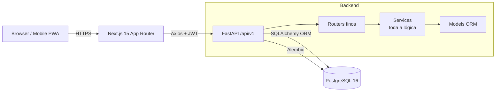

# RotaVenda

[](https://github.com/ednanferreira/rotavenda/actions/workflows/ci.yml)
[](LICENSE)


Sistema full-stack de gestão de vendas e **fiado** para comércio de bairro.
Substitui o caderno físico de anotações com dois canais de venda — **rota**
(vendedor móvel) e **loja** (balcão) — cálculo de saldo em tempo real,
parcelamento com matching FIFO e rotas configuráveis.

> Este repositório é uma **versão sanitizada de um projeto em produção**.
> Todos os dados de cliente, endereços e credenciais foram substituídos por
> material sintético gerado com `Faker`. O código de negócio é idêntico ao
> sistema real.

---

## Stack

| Camada | Tecnologia |
| --- | --- |
| Backend | Python 3.11 · FastAPI · SQLAlchemy (sync/psycopg2) · Alembic |
| Banco | PostgreSQL 16 |
| Frontend | Next.js 15 (App Router) · TypeScript · Tailwind CSS · shadcn/ui |
| Estado servidor | TanStack Query v5 |
| Forms / Validação | react-hook-form + zod |
| HTTP | Axios (com interceptors de refresh token) |
| Auth | JWT (access em `localStorage` + refresh em cookie `httpOnly`) |
| Infra | Docker Compose |
| CI | GitHub Actions (pytest + black + isort + ESLint + build) |

---

## Funcionalidades

- **Catálogo de produtos** com preço, unidade, estoque e ajuste manual
- **Clientes** com vínculo many-to-many a múltiplas ruas (endereço flexível)
- **Rotas diárias** a partir de *templates* imutáveis reutilizáveis pelo vendedor
- **Vendas mistas** — à vista ou fiado, canal rota ou loja, com desconto opcional
- **Parcelamento** configurável (datas e valores) — validação de soma no backend
- **Pagamentos** com matching FIFO automático em parcelas em aberto (`due_date` ASC)
- **Saldo do cliente** calculado em tempo real — nunca armazenado
- **Edição segura** de venda: bloqueia alterações após quitação parcial
- **Relatórios** para gerente (resumo diário, por vendedor, por período)
- **Autorização por papel** — GERENTE vs VENDEDOR
- **Mobile-first** — projetado para uso com uma mão no campo

---

## Como rodar

### Pré-requisitos

- Docker + Docker Compose
- Node 20+ e Python 3.11+ (apenas se quiser rodar fora do Docker)

### Subir tudo

```bash
cp backend/.env.example backend/.env
cp frontend/.env.local.example frontend/.env.local

make up           # docker compose up --build
make seed         # popula o banco com dados sintéticos
```

Acesse:

- Frontend — <http://localhost:3000>
- API docs (Swagger) — <http://localhost:8000/docs>

### Credenciais de demonstração

| Papel | Email | Senha |
| --- | --- | --- |
| Gerente | `admin@example.com` | `admin123` |
| Vendedor | `vendedor@example.com` | `vendedor123` |

### Outros comandos

```bash
make test         # pytest dentro do container backend
make lint         # ESLint no frontend
make format       # black + isort no backend
make migrate      # alembic upgrade head
make clean        # derruba containers + volumes (reset total)
make help         # lista todos os targets
```

---

## Arquitetura em uma imagem



Detalhes em [ARCHITECTURE.md](ARCHITECTURE.md) e decisões registradas em
[docs/adr/](docs/adr/).

---

## Desafios técnicos destacados

Cada item abaixo é uma decisão consciente documentada em ADR:

1. **Saldo calculado em runtime** — elimina risco de desincronização
   ([ADR 0001](docs/adr/0001-saldo-calculado.md))
2. **Refresh token em cookie `httpOnly`** — defesa em profundidade contra XSS
   ([ADR 0002](docs/adr/0002-refresh-token-cookie.md))
3. **Router fino / service gordo** — toda regra de negócio em `app/services/`
   ([ADR 0003](docs/adr/0003-router-fino-service-gordo.md))
4. **Soft-delete via `is_active`** — auditoria e reversão sem perder histórico
   ([ADR 0004](docs/adr/0004-soft-delete-via-is-active.md))
5. **Templates imutáveis de rota** — blueprint duplicado em cada rota do dia
   ([ADR 0005](docs/adr/0005-templates-imutaveis-de-rota.md))

Outros pontos não-triviais:

- **Matching FIFO de pagamentos** com `SELECT ... FOR UPDATE` para evitar
  corrida entre dois pagamentos simultâneos no mesmo cliente
- **Imutabilidade condicional** na edição de venda: após qualquer parcela ter
  `paid_amount > 0`, o backend bloqueia alteração de itens/desconto (HTTP 400)
- **Testes de integração com savepoints transacionais** — cada teste roda
  dentro de uma transação revertida; não precisa de banco dedicado nem teardown
- **Migrations 100% reversíveis** — todo `upgrade()` tem `downgrade()` pareado

---

## Testes

A suíte de integração roda contra um Postgres real (mesmo `.env`).
Cada teste abre uma transação que é revertida ao final — sem sujeira entre
testes.

```bash
make test                                                    # tudo
docker compose exec backend pytest tests/test_sale_service.py -v   # arquivo
docker compose exec backend pytest -k fifo                   # por palavra-chave
```

No CI (GitHub Actions) os testes rodam com cobertura via `pytest-cov`.

---

## Estrutura do repositório

```text
.
├── backend/           FastAPI + SQLAlchemy + Alembic + pytest
│   ├── app/
│   │   ├── api/v1/    routers (finos)
│   │   ├── core/      config, segurança, JWT
│   │   ├── db/        sessão + seed sintético
│   │   ├── models/    SQLAlchemy ORM
│   │   ├── schemas/   Pydantic I/O
│   │   └── services/  lógica de negócio
│   ├── alembic/       migrations reversíveis
│   └── tests/         integração com savepoints
├── frontend/          Next.js 15 App Router + Tailwind + TanStack Query
│   └── src/
│       ├── app/       rotas (segmentos (app) e (auth))
│       ├── components/  shared, rota, ui (shadcn)
│       ├── hooks/     useClients, useSales, ...
│       ├── lib/       api.ts (Axios), auth.ts, constants.ts
│       └── types/     interfaces TypeScript
├── docs/              visão geral da API + diagramas + ADRs
└── .github/workflows/ CI: backend (pytest + lint) e frontend (lint + build)
```

---

## Roadmap / próximos passos

- [ ] Exportação CSV/PDF de relatórios do gerente
- [ ] Fila offline no frontend para vendas em rota sem cobertura
- [ ] Modo PWA com sincronização em background
- [ ] Métricas em Prometheus/Grafana

---

## Contribuindo

Veja [CONTRIBUTING.md](CONTRIBUTING.md) para convenções de commit, padrões de
código e checklist antes de abrir um PR.

## Licença

[MIT](LICENSE)
